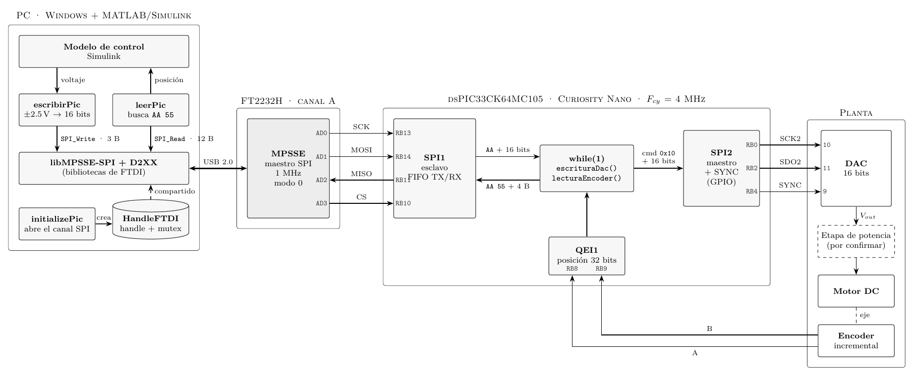

# DAQ-SPI

Tarjeta de adquisición de datos de bajo costo, funcionalmente equivalente a
una tarjeta tipo Quanser, basada en el microcontrolador dsPIC33CK64MC105
(Curiosity Nano). El sistema se controla en tiempo real desde Simulink mediante
un puente USB–SPI FT2232H y ofrece una salida analógica de ±2.5 V y la lectura
de un encoder en cuadratura.

## Arquitectura



En la PC, el modelo de Simulink invoca S-Functions en C++ que utilizan la
biblioteca libMPSSE-SPI de FTDI para operar el FT2232H como maestro SPI. El
dsPIC actúa como esclavo de este bus: recibe el valor que debe escribirse en el
DAC y devuelve la posición del encoder. Internamente, el dsPIC emplea tres
periféricos:

| Periférico | Función |
|---|---|
| SPI1 (esclavo) | Enlace con el FT2232H |
| SPI2 (maestro) | Escritura al DAC de 16 bits |
| QEI1 | Conteo de pulsos del encoder del motor |

El reloj del microcontrolador proviene del oscilador interno FRC de 8 MHz, sin
PLL (F<sub>osc</sub> = 8 MHz, F<sub>cy</sub> = 4 MHz).

## Conexiones

| Señal | dsPIC | FT2232H | DAC |
|---|---|---|---|
| SCK1 (entrada) | RB13 | AD0 (SCK) | |
| SDI1 | RB14 | AD1 (MOSI) | |
| SDO1 | RB11 | AD2 (MISO) | |
| SS1 | RB10 | AD3 (CS) | |
| SCK2 | RB0 | | pin 10 |
| SDO2 | RB2 | | pin 11 |
| SYNC (GPIO) | RB4 | | pin 9 |
| QEI A / B | RB8 / RB9 | | |
| LED0 | RD10 | | |

## Protocolo de comunicación

El FT2232H opera a 1 MHz en modo SPI 0, con `CS` activo en bajo en `DBUS3` y
un *latency timer* de 1 ms. En la versión actual, la escritura y la lectura se
realizan como transacciones independientes.

### Escritura (PC → dsPIC)

Cada transacción consta de tres bytes:

| Byte | Contenido |
|---|---|
| 0 | Encabezado `0xAA` |
| 1 | Valor del DAC, byte alto |
| 2 | Valor del DAC, byte bajo |

El voltaje solicitado se convierte según `valor = 13107 · (V + 2.5)`, de modo
que −2.5 V, 0 V y +2.5 V corresponden a 0, 32767 y 65535, respectivamente. El
dsPIC retransmite el valor al DAC precedido del byte de comando `0x10`.

### Lectura (dsPIC → PC)

La PC lee doce bytes y localiza en ellos la secuencia siguiente:

| Byte | Contenido |
|---|---|
| 0–1 | Encabezado `0xAA 0x55` |
| 2–5 | Posición del QEI, `int32` *little-endian* |

## Firmware

El firmware se desarrolló en MPLAB X con MCC y el compilador XC-DSC (o XC16),
usando el pack `dsPIC33CK-MC_DFP`. Se mantienen tres variantes: una que sólo
transmite la posición del encoder, otra que sólo recibe y escribe al DAC, y
`dsPicController`, que integra ambas funciones y es la que se utiliza en
operación normal.

La tarjeta se programa con el depurador integrado de la Curiosity Nano o
copiando el archivo `.hex` a la unidad USB `CURIOSITY` que aparece al
conectarla.

## Software en la PC

El acceso al FT2232H se divide en tres S-Functions que comparten un mismo
*handle*:

| S-Function | Función |
|---|---|
| `initializePic` | Abre el canal SPI y entrega como señal (`uint64`) un apuntador a la estructura `HandleFTDI` |
| `escribirPic` | Recibe un voltaje en el intervalo ±2.5 V y lo transmite al dsPIC |
| `leerPic` | Obtiene la posición del encoder |

`HandleFTDI` incluye un mutex del sistema operativo que impide el acceso
simultáneo al dispositivo desde distintos bloques.

Se incluyen los binarios `.mexw64` para Windows de 64 bits. Para recompilarlos
se ejecuta, desde MATLAB y en el directorio del modelo, una instrucción de la
forma:

```matlab
mex escribirPic.cpp libmpsse.lib
```

Las bibliotecas `libmpsse.dll` y `msvcr120.dll` deben encontrarse en el mismo
directorio que el modelo, y es necesario instalar el driver CDM de FTDI
(v2.12.36.4) incluido en el repositorio.

## Limitaciones conocidas

Cuando la lectura y la escritura operan simultáneamente, la comunicación se
corrompe. El análisis del firmware y del uso del bus identifica las causas
siguientes:

1. **Uso half-duplex de un bus full-duplex.** La PC ejecuta `SPI_Write` y
   `SPI_Read` por separado. Durante la escritura, el dsPIC desplaza por MISO
   datos del encoder que la PC descarta; durante la lectura, la PC envía bytes
   de relleno que el dsPIC interpreta como datos.
2. **Respuesta sin sincronía con el maestro.** El esclavo escribe la posición
   en la FIFO de transmisión cada vez que hay espacio, sin relación con el
   momento en que la PC lee. Los datos llegan desfasados y desalineados.
3. **Espera activa en el lazo principal.** La escritura en SPI1 bloquea
   mientras la FIFO de transmisión esté llena, condición que sólo cambia cuando
   el maestro genera reloj. Durante ese tiempo no se atiende la recepción.
4. **Desbordamiento sin recuperación.** Si la FIFO de recepción se llena, se
   activa `SPIROV`; el driver generado por MCC no limpia la bandera y el módulo
   deja de recibir.
5. **Falta de delimitación de tramas.** El dsPIC no utiliza `CS` para
   identificar el inicio de cada trama y se limita a buscar `0xAA`, valor que
   puede aparecer dentro de los datos.

El mutex de la PC evita el acceso concurrente al FT2232H, pero no interviene en
ninguno de estos fenómenos. Adicionalmente, al terminar la simulación se envía
el valor `0x0000`, que corresponde a −2.5 V y no a 0 V, por lo que el motor
permanece energizado.

## Trabajo en curso

Se propone sustituir el protocolo actual por una única transferencia
full-duplex de ocho bytes por paso de simulación (`SPI_ReadWrite`), delimitada
por `CS` y protegida con número de secuencia y CRC-8. En el dsPIC, SPI1 se
atenderá mediante DMA, y la interrupción asociada al flanco de subida de `CS`
procesará la trama recibida y preparará la respuesta siguiente. El análisis
completo, el formato de trama y el plan de validación se encuentran en
[`docs/propuesta.pdf`](docs/propuesta.pdf).
